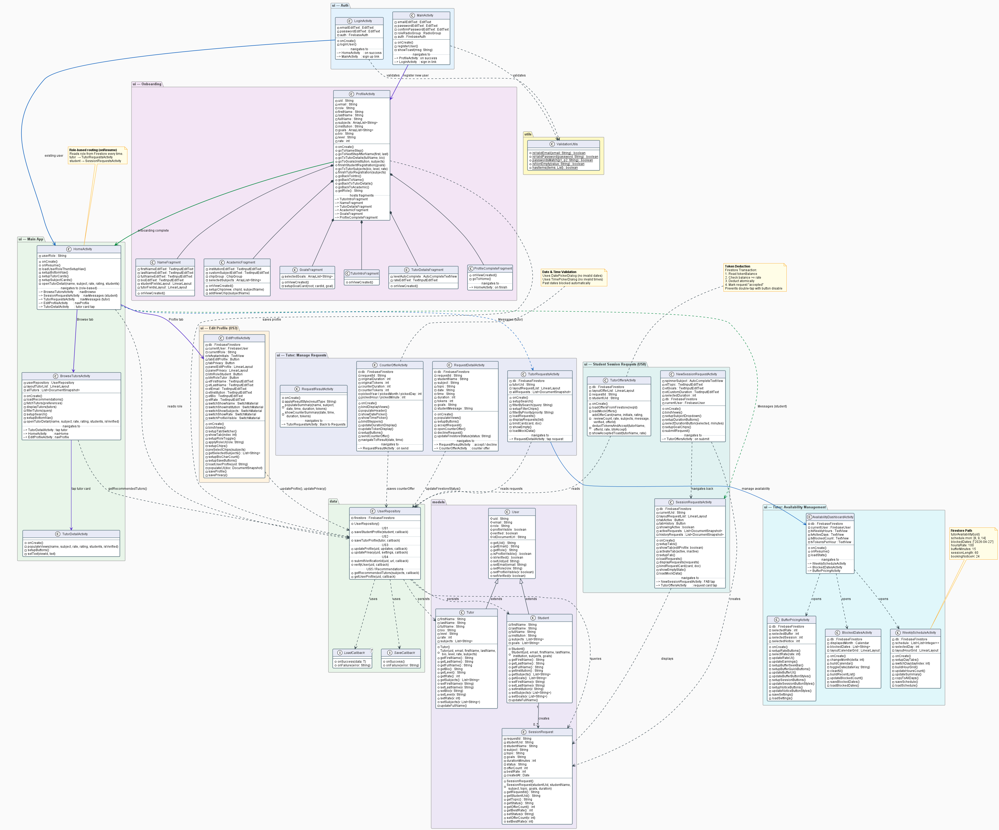
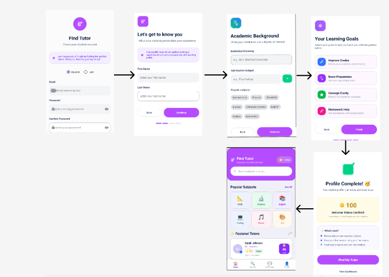

# Project Documentation

## TA Feedback <a name="ta-feedback"></a>
> **Status:** No major feedback to be incorporated, received from TA on Phase 3. The project is proceeding according to the original design with minor refinements to the onboarding flow.

- [Team Information](#team-information)
- [Project Structure & Documentation](#project-structure)

- [Meeting Minutes](#meeting-minutes)
  - [Meeting – Feb 23, 2026](#meeting--feb-23-2026)
  - [Meeting – Mar 2, 2026](#meeting--mar-2-2026)
  - [Meeting – Mar 8, 2026](#meeting--mar-8-2026)
  - [Meeting – Mar 26, 2026](#meeting--mar-26-2026)
  - [Meeting – Apr 01, 2026](#meeting--apr-01-2026)
  - [Meeting – Apr 05, 2026](#meeting--apr-05-2026)
  - [Meeting – Apr 10, 2026](#meeting--apr-10-2026)
  - [Meeting – Apr 17, 2026](#meeting--apr-17-2026)
  - [Meeting – Apr 24, 2026](#meeting--apr-24-2026)
  - [Meeting – May 2, 2026](#meeting--may-2-2026)

- [UML Diagrams](#uml-diagrams)

- [Object-Oriented Analysis (CRC Cards)](#object-oriented-analysis)

- [Product Backlog](#product-backlog)
  - [Product Backlog – Project Part 1](#product-backlog--project-part-1)
  - [Product Backlog – Project Part 2](#product-backlog--project-part-2)
  - [Product Backlog – Project Part 3](#product-backlog--project-part-3)
  - [Product Backlog – Project Part 4](#product-backlog--project-part-4)

- [Sprint Planning & Reviews](#sprint-planning-reviews)

- [Wireframes](#wireframes)
  - [Wireframes – Project Part 1](#wireframes--project-part-1)
  - [Wireframes – Project Part 2 (Figma)](#wireframes--project-part-2)
  - [Wireframes – Project Part 3](#wireframes--project-part-3)
  - [Wireframes – Project Part 4](#wireframes--project-part-4)

---

## Team Information <a name="team-information"></a>
- Team Name: apollo

| Name                  | Roll Number | GitHub ID            |
|-----------------------|-------------|----------------------|
| Ali Iqbal             | 27100129    | aliiqbal07           |
| Abdullah Khaliq       | 27100400    | abdullahkhaliq12     |
| M. Abdullah Iqbal     | 27100457    | abdullahiqbal27100457|
| Hassan Fayyaz         | 27100397    | HassanFyyz           |
| M. Zain ul Abideen    | 27100180    | Zain100796           |

---
## Project Structure & Documentation Strategy <a name="project-structure"></a>

### **Directory Structure**
The Apollo project follows a clean architecture pattern, separating data persistence, business logic, and UI components.

```text
PeerTutoring-Apollo/                                                                                                                                                     
  ├── app/src/main/java/com/example/peertutoring/                                                                                                                          
  │   ├── data/               # DATA LAYER: Handles Firestore transactions and API calls.                                                                                  
  │   │   └── UserRepository.java              # Central repository for all user & tutor data ops.                                                                         
  │   │                                                                                                                                                                    
  │   ├── models/             # DOMAIN LAYER: Data models (POJOs) representing system entities.                                                                            
  │   │   ├── User.java                        # Base model for all authenticated users.                                                                                   
  │   │   ├── Student.java                     # Extension for student-specific profiles (US 01).                                                                          
  │   │   ├── Tutor.java                       # Extension for tutor-specific professional data (US 02).                                                                   
  │   │   ├── SessionRequest.java              # State machine for the session lifecycle (US 16).                                                                          
  │   │   └── CrashCourse.java                 # Model for tutor-created multi-session courses.                                                                            
  │   │                                                                                                                                                                    
  │   ├── ui/                 # PRESENTATION LAYER: View Controllers (Activities & Fragments).                                                                             
  │   │   ├── MainActivity.java                # Splash/entry point; routes to login or home.                                                                              
  │   │   ├── LoginActivity.java               # Firebase email/password authentication.                                                                                   
  │   │   ├── ProfileActivity.java             # Multi-step onboarding profile setup (US 01–02).                                                                           
  │   │   ├── NameFragment.java                # Onboarding step: name entry.                                                                                              
  │   │   ├── AcademicFragment.java            # Onboarding step: institution & subjects.                                                                                  
  │   │   ├── GoalsFragment.java               # Onboarding step: learning goals.                                                                                          
  │   │   ├── TutorIntroFragment.java          # Onboarding step: tutor intro & bio.                                                                                       
  │   │   ├── TutorDetailsFragment.java        # Onboarding step: tutor rate & level.                                                                                      
  │   │   ├── ProfileCompleteFragment.java     # Onboarding completion confirmation screen.                                                                                
  │   │   ├── HomeActivity.java                # Student home dashboard.                                                                                                   
  │   │   ├── TutorHomeActivity.java           # Tutor home dashboard.                                                                                                     
  │   │   ├── EditProfileActivity.java         # Edit existing profile details (US 03–04).                                                                                 
  │   │   ├── BrowseTutorsActivity.java        # Tutor discovery & search (US 05–06).                                                                                      
  │   │   ├── TutorDetailActivity.java         # Tutor public profile view (US 05).                                                                                        
  │   │   ├── NewSessionRequestActivity.java   # Student creates a session request (US 08).                                                                                
  │   │   ├── SessionRequestsActivity.java     # Student's list of sent requests (US 08).                                                                                  
  │   │   ├── TutorRequestsActivity.java       # Tutor's incoming request inbox (US 09).                                                                                   
  │   │   ├── TutorOffersActivity.java         # Tutor counter-offer management (US 10).                                                                                   
  │   │   ├── CounterOfferActivity.java        # Student reviews a tutor counter-offer (US 10).                                                                            
  │   │   ├── RequestDetailActivity.java       # Detailed view of a single session request.                                                                                
  │   │   ├── RequestResultActivity.java       # Confirmation screen after request action.
  │   │   ├── InstantBookActivity.java         # Instant booking flow (US 11).                                                                                             
  │   │   ├── RescheduleActivity.java          # Reschedule a booked session.
  │   │   ├── SessionNotesActivity.java        # Post-session notes entry (US 17).                                                                                         
  │   │   ├── RateReviewActivity.java          # Post-session rating & review (US 18).                                                                                     
  │   │   ├── MessagingActivity.java           # In-app chat between student and tutor.                                                                                    
  │   │   ├── TutorChatListActivity.java       # Tutor's list of active chat threads.                                                                                      
  │   │   ├── WeeklyScheduleActivity.java      # Tutor sets weekly availability (US 13).
  │   │   ├── AvailabilityDashboardActivity.java # Overview of tutor's availability settings.                                                                              
  │   │   ├── BlockedDatesActivity.java        # Tutor blocks specific unavailable dates (US 13).                                                                          
  │   │   ├── BufferPricingActivity.java       # Tutor configures buffer time & pricing (US 13).                                                                           
  │   │   ├── StudentPreferencesActivity.java  # Student sets scheduling preferences (US 14).                                                                              
  │   │   ├── BuyTokensActivity.java           # Token purchase flow (US 22).                                                                                              
  │   │   ├── PurchaseSuccessActivity.java     # Confirmation screen after token purchase.                                                                                 
  │   │   ├── TransactionHistoryActivity.java  # Token transaction ledger (US 23).                                                                                         
  │   │   ├── TutorEarningsActivity.java       # Tutor earnings summary (US 25).                                                                                           
  │   │   ├── WithdrawActivity.java            # Tutor token withdrawal flow (US 25).                                                                                      
  │   │   ├── WithdrawSuccessActivity.java     # Confirmation screen after withdrawal.                                                                                     
  │   │   ├── CoursesActivity.java             # Browse & enrol in crash courses.                                                                                          
  │   │   ├── CoursesDetailActivity.java       # Crash course detail view.                                                                                                 
  │   │   ├── CreateCourseActivity.java        # Tutor creates a new crash course.                                                                                         
  │   │   └── SeedDataActivity.java            # Dev-only: seeds Firestore with test data.                                                                                 
  │   │                                                                                                                                                                    
  │   └── utils/              # HELPERS: Utility classes for validation and business logic.                                                                                
  │       ├── ValidationUtils.java             # Input validation helpers (email, fields).                                                                                 
  │       ├── EscrowManager.java               # Token escrow hold/release/refund logic (US 24).                                                                           
  │       ├── ExpirationUtils.java             # Detects and expires stale session requests.                                                                               
  │       ├── CancellationUtils.java           # Handles cancellation rules and token refunds.                                                                             
  │       ├── ConflictChecker.java             # Checks scheduling conflicts against availability.                                                                         
  │       ├── RankingEngine.java               # Scores and ranks tutors for search results (US 06).                                                                       
  │       ├── LowBalanceDialog.java            # Reusable dialog for low token balance warnings.                                                                           
  │       └── SoundManager.java               # Plays UI feedback sounds for key actions.                                                                                  
  │                                                                                                                                                                        
  ├── app/src/test/           # UNIT TESTS: Logic tests for models, utils, and control classes.                                                                            
  │   ├── ModelUnitTest.java                   # Data integrity tests for model constructors.                                                                              
  │   ├── SessionLifecycleTest.java            # Validates status transitions (Requested → Booked).                                                                        
  │   ├── CrashCourseUnitTest.java             # Tests crash course model and enrolment logic.                                                                             
  │   ├── BuyTokensUnitTest.java               # Tests token purchase calculation logic.                                                                                   
  │   ├── InstantBookUnitTest.java             # Tests instant booking eligibility checks.                                                                                 
  │   ├── RateReviewUnitTest.java              # Tests rating aggregation logic.                                                                                           
  │   ├── SessionNotesUnitTest.java            # Tests session notes save/retrieve logic.
  │   ├── TutorEarningsUnitTest.java           # Tests earnings calculation logic.                                                                                         
  │   ├── StudentPreferencesUnitTest.java      # Tests preference persistence logic.
  │   ├── StudentPreferencesTest.java          # Additional preference edge-case tests.                                                                                    
  │   ├── RankingEngineTest.java               # Tests tutor ranking/scoring algorithm (US 06).                                                                            
  │   ├── CancellationUtilsTest.java           # Tests cancellation and refund rules.                                                                                      
  │   ├── ExpirationUtilsTest.java             # Tests request expiration window logic.                                                                                    
  │   └── ConflictCheckerTest.java             # Tests scheduling conflict detection.                                                                                      
  │               
  └── app/src/androidTest/    # INTENT TESTS: UI/Navigation tests using Espresso.
      ├── UserStoriesIntentTest.java           # Covers Onboarding, Search & Privacy (US 01–06).                                                                           
      ├── SessionFlowIntentTest.java           # Covers request creation & response (US 08–10).                                                                            
      ├── TutorAvailabilityIntentTest.java     # Covers scheduling & pricing settings (US 13).                                                                             
      ├── StudentPreferencesIntentTest.java    # Covers student preference screens (US 14).                                                                                
      ├── InstantBookIntentTest.java           # Covers instant booking UI flow (US 11).                                                                                   
      ├── BuyTokensIntentTest.java             # Covers token purchase screens (US 22).                                                                                    
      ├── TutorEarningsIntentTest.java         # Covers earnings & withdrawal screens (US 25).                                                                             
      ├── RateReviewIntentTest.java            # Covers post-session rating flow (US 18).
      ├── SessionNotesIntentTest.java          # Covers session notes UI (US 17).                                                                                          
      └── ExpirationIntentTest.java            # Covers expired request handling UI. 
```
---
### **Documentation Strategy**
To satisfy the requirements of **Phase 3 Deliverable #3**, the Apollo team has implemented a multi-tier documentation approach:

* **Source Documentation:** Every `.java` file in the repository begins with a standardized introductory block. This header describes the file's specific **role** (e.g., UI Controller, Data Repository) and any **design patterns** utilized (such as Singleton, Observer, or State).
* **API Documentation:** All model classes located in `com.example.peertutoring.models` are fully documented using **Javadoc**. This includes comprehensive interface documentation for all public methods, constructors, `@param` tags, and `@return` values to ensure long-term maintainability.
* **Test Documentation:** To ensure **100% requirement traceability**, all Intent Tests in the `androidTest` directory are explicitly mapped to their corresponding **User Story IDs** (e.g., US 01, US 04). This allows for a clear audit trail between the requirements and the functional verification.
---
## Meeting Minutes

### Meeting – Feb 23, 2026

#### Date
Monday, February 23, 2026

#### Attendance
- Ali Iqbal  
- Abdullah Khaliq  
- M. Abdullah Iqbal  
- Hassan Fayyaz  
- M. Zain ul Abideen  

---

#### Key Takeaways
- Initial discussion held with the TA regarding project progress and setup.
- Figma screens were discussed.
- The team was instructed to add the professor and TA to the GitHub repository.
- The repository was to be made private.
- Relevant links for wireframes and product backlog were shared.

---

#### Discussion Points
- Figma screen designs
- GitHub repository access and privacy settings
- Wireframe-related resources
- Product backlog-related resources

---

#### Action Items
- [x] Finalize and improve Figma screens  
- [x] Add professor and TA to the GitHub repository  
- [x] Make the GitHub repository private  
- [x] Review shared links for wireframes  
- [x] Review shared links for product backlog  

---

### Meeting – Mar 2, 2026

#### Date
Monday, March 2, 2026

#### Attendance
- Ali Iqbal  
- Abdullah Khaliq  
- M. Abdullah Iqbal  
- Hassan Fayyaz  
- M. Zain ul Abideen  

---

#### Key Takeaways
- A general overview discussion of the project progress was conducted.
- The TA reviewed the current progress of the team.
- Clarifications were provided regarding the Figma screens.

---

#### Discussion Points
- Current progress overview
- Feedback on ongoing work
- Clarifications on Figma screens

---

#### Action Items
- [x] Incorporate TA feedback into Figma screens  
- [x] Continue progress on the assigned project tasks  
- [x] Update documentation as the project moves forward  

---

### Meeting – Mar 8, 2026

#### Date
Sunday, March 8, 2026

#### Attendance
- Ali Iqbal  
- Abdullah Khaliq  
- M. Abdullah Iqbal  
- Hassan Fayyaz  
- M. Zain ul Abideen  

---

#### Key Takeaways
- Completed the Object Oriented Analysis by consolidating team ideas into a 9 class CRC card structure.
- Updated the Phase 2 Product Backlog to include mandatory columns for Story Points, Risk, and Checkpoint tracking.
- Clarifications were provided regarding the Figma screens.

---

#### Discussion Points
- Defining the boundaries between the Wallet and EscrowManager to handle token security.
- Categorizing the RankingEngine and Payment logic as "High Risk" due to technical complexity.
- Feedback on ongoing work
- Ensuring all diagrams are embedded as images directly in the README

---

#### Action Items
- [x] Finalize CRC card image and upload to /doc folder
- [x] Map 25 user stories to class rationales for requirement coverage  
- [x] Populate the Part 2 Product Backlog table with Priority and Points
- [x] Embed Figma UI URLS into the Wireframes section with description

---

### Meeting – Mar 26, 2026

#### Date
Thursday, March 26, 2026

#### Attendance
- Ali Iqbal  
- Abdullah Khaliq  
- M. Abdullah Iqbal  
- Hassan Fayyaz  
- M. Zain ul Abideen  

---

#### Key Takeaways
- The team discussed the approach for Project Phase 3.
- Finalized User Stories 1-4 for the Half-Way Checkpoint.
- Planned Javadoc implementation and Intent testing strategy.

---

#### Discussion Points
- Planning approach for Phase 3  
- Feedback on strengths and weaknesses from Phase 2  
- Clarification on working structure (epic-wise vs user story-wise)  

---

#### Action Items
- [x] Implement Javadoc for all Model and Control classes.
- [x] Write Intent tests for US 1, 2, 3, and 4.
- [x] Ensure Firestore connectivity for profile saving.

---
### Meeting – Apr 01, 2026
#### Date
Wednesday, Apr 01, 2026
#### Attendance
- Ali Iqbal  
- Abdullah Khaliq  
- M. Abdullah Iqbal  
- Hassan Fayyaz  
- M. Zain ul Abideen  
---
#### Key Takeaways
- Successfully closed Sprint 1 and transitioned to Sprint 2.
- Picked up User Stories 5, 8, 9, and 10 for Sprint 2 implementation.
- Add test cases for all four user stories to support testing efforts.
- Sprint 2 is targeted to conclude by April 5, 2026.
---
#### Discussion Points
- Review and closure of Sprint 1 deliverables
- Planning and scope definition for Sprint 2
- Breakdown of US 05 (Recommended Tutors), US 08 (Request a Session), US 09 (Tutor Responds to Request), and US 10 (Track Request Status)
- Test case design and coverage for the four new user stories
---
#### Action Items
- [x] Implement US 05 – Recommended tutor listings based on subject/course and student preferences
- [x] Implement US 08 – Session request flow with topic, goals, and duration fields
- [x] Implement US 09 – Tutor response flow (accept / decline / counter-offer)
- [x] Implement US 10 – Request status tracking view (pending / accepted / declined / counter-offer / expired)
- [x] Write and integrate test cases for US 05, 08, 09, and 10
- [x] Close Sprint 2 by April 5, 2026
---
### Meeting – Apr 05, 2026
#### Date
Sunday, April 05, 2026
#### Attendance
- Ali Iqbal  
- Abdullah Khaliq  
- M. Abdullah Iqbal  
- Hassan Fayyaz  
- M. Zain ul Abideen  
---
#### Key Takeaways
- Successfully closed Sprint 2 and transitioned to Sprint 3.
- Picked up User Stories 13 and 16 for Sprint 3 implementation and User Story  06 if time left
- Planned Javadoc implementation and full Phase 3 documentation alongside development.
- UML diagram update scheduled as part of Sprint 3 deliverables.
- Sprint 3 is targeted to conclude by April 7, 2026.
---
#### Discussion Points
- Review and closure of Sprint 2 deliverables
- Planning and scope definition for Sprint 3
- Breakdown of US 13 (Tutor Sets Availability Calendar) and US 16 (Session Lifecycle Tracking)
- Strategy for Javadoc coverage across all Phase 3 classes
- Documentation structure and UML diagram update requirements
---
#### Action Items
- [x] Implement US 13 – Tutor weekly availability setup (working hours, unavailable dates, buffer time) for accurate slot generation
- [x] Implement US 16 – Session lifecycle status tracking (requested → booked → completed / cancelled / no-show)
- [x] Add Javadoc to all Phase 3 model and control classes
- [x] Complete full documentation for Phase 3
- [x] Update UML diagram to reflect Sprint 3 additions
- [x] Implement US 06
- [x] Close Sprint 3 by April 7, 2026
---

## Meeting – Apr 10, 2026

### Date
Friday, April 10, 2026

### Attendance
- Ali Iqbal  
- Abdullah Khaliq  
- M. Abdullah Iqbal  
- Hassan Fayyaz  
- M. Zain ul Abideen  

---

### Key Takeaways
- Discussed Phase 3 progress and identified weaknesses in booking validation and UI flow.  
- Planned overall strategy for Project Phase 4.  
- Finalized Sprint 1 user stories and responsibilities.  

---

### Discussion Points
- Review of previous phase  
- Planning strategy for Phase 4  
- Improvements to booking and filtering systems  
- App fixes and optimization planning  

---

### Action Items
- [x] Implement US 07 – Matching Preferences  
- [x] Implement US 11 – Auto Expire Requests  
- [x] Implement US 12 – Instant Booking  
- [x] Fix UI and validation issues  
- [x] Prepare Sprint 1 documentation  

---

## Meeting – Apr 17, 2026

### Date
Friday, April 17, 2026

### Attendance
- Ali Iqbal  
- Abdullah Khaliq  
- M. Abdullah Iqbal  
- Hassan Fayyaz  
- M. Zain ul Abideen  

---

### Key Takeaways
- Successfully completed Sprint 1 with US 07, US 11, and US 12.  
- Discussed testing results and improvements.  
- Planned Sprint 2 implementation.  

---

### Discussion Points
- Sprint 1 review  
- Improvements in booking workflow  
- Sprint 2 planning  
- General app fixes  

---

### Action Items
- [x] Close Sprint 1  
- [x] Implement US 14 – Prevent Double Booking  
- [x] Implement US 15 – Reschedule/Cancel Sessions  
- [x] Implement US 17 – Session Notes  
- [x] Implement US 18 – Rate & Review  
- [x] Add test cases and bug fixes  

---

## Meeting – Apr 24, 2026

### Date
Friday, April 24, 2026

### Attendance
- Ali Iqbal  
- Abdullah Khaliq  
- M. Abdullah Iqbal  
- Hassan Fayyaz  
- M. Zain ul Abideen  

---

### Key Takeaways
- Successfully completed Sprint 2 with US 14, US 15, and US 17, US 18.  
- Planned Sprint 3 focused on wallet and escrow features.  
- Improved app stability and navigation flow.  

---

### Discussion Points
- Sprint 2 review  
- Conflict handling and review system  
- Financial feature planning  
- Documentation updates  

---

### Action Items
- [x] Close Sprint 2  
- [x] Implement US 19 – Buy Tokens  
- [x] Implement US 20 – Escrow Hold  
- [x] Implement US 21 – Token Withdrawal  
- [x] Improve transaction handling and app stability  

---

## Meeting – May 2, 2026

### Date
Saturday, May 2, 2026

### Attendance
- Ali Iqbal  
- Abdullah Khaliq  
- M. Abdullah Iqbal  
- Hassan Fayyaz  
- M. Zain ul Abideen  

---

### Key Takeaways
- Successfully completed Sprint 3 with US 19, US 20, and US 21.  
- Finalized Phase 4 implementation and testing.  
- Completed app fixes and documentation updates.  

---

### Discussion Points
- Sprint 3 review  
- Wallet and escrow verification  
- Final testing and bug fixing  
- Submission preparation  

---

### Action Items
- [x] Close Sprint 3  
- [x] Complete final testing  
- [x] Apply final UI fixes  
- [x] Finalize documentation and UML  
- [x] Prepare project submission  

---

## UML Diagrams <a name="uml-diagrams"></a>




---

## Object-Oriented Analysis


### Class Rationales
  - Account: Serves as the security and identity hub, centralizing authentication logic and the "Verified" badge system to ensure platform trust (US 01, 04).
  - Student: Encapsulates learner-specific behaviors, focusing on setting educational goals, preferences, and the booking lifecycle (US 05, 07, 18).
  - Tutor: Manages professional provider attributes, including subject expertise, pricing models, and post-session pedagogical feedback (US 02, 17, 25).
  - Session: Acts as the central state machine and primary controller, managing the transition from request to completion while enforcing system-wide rules (US 08, 16).
  - AvailabilityManager: Decouples complex scheduling logic from user profiles to prevent double booking and automatically generate bookable slots (US 12, 13, 14).
  - RankingEngine: Implements the recommendation logic by matching student preferences against tutor performance metrics like rating and responsiveness (US 05, 06).
  - Wallet: Handles the financial data layer, managing real time token balances, purchase transactions, and tutor withdrawal conversions (US 23, 25).
  - EscrowManager: Mitigates financial risk by holding tokens in a protected "Pending" state, releasing them only upon verified session completion (US 24).
  - Review: Maintains community quality standards by linking feedback directly to verified sessions and providing a reporting mechanism for inappropriate content (US 19, 21).

---

## Product Backlog

### Product Backlog – Project Part 1
| ID | User Story | Priority | Status |
|----|------------|----------|--------|

### Product Backlog – Project Part 2
| ID | User Story | Priority | Status | Risk | Points | Checkpoint |
|:---|:---|:---|:---|:---|:---|:---|
| **US 01** | Student Signup: Create account with goals/subjects | High | Open | Low | 3 | Half |
| **US 02** | Tutor Signup: Create profile with bio/rates | High | Open | Low | 3 | Half |
| **US 03** | Edit Profile: Manage visibility and accuracy | Medium | Open | Low | 2 | Half |
| **US 04** | Verification Badge: Upload ID for "Verified" status | Medium | Open | Medium | 5 | Half |
| **US 05** | Recommended Tutors: View tutors based on needs | High | Open | High | 8 | Final |
| **US 06** | Ranking Logic: System ranks by rating/responsiveness | High | Open | High | 13 | Final |
| **US 07** | Matching Preferences: Filter by budget/level/type | Medium | Open | Medium | 5 | Final |
| **US 08** | Request a Session: Student sends request with goals | High | Open | Medium | 5 | Half |
| **US 09** | Tutor Response: Accept, decline, or counter-offer | High | Open | Medium | 5 | Half |
| **US 10** | Track Request Status: View pending/accepted status | Medium | Open | Low | 3 | Half |
| **US 11** | Auto-Expire: System clears old pending requests | Low | Open | Medium | 3 | Final |
| **US 12** | Instant Book: Book slots without tutor approval | Medium | Open | Medium | 5 | Final |
| **US 13** | Tutor Availability: Set weekly hours/breaks | High | Open | Medium | 5 | Half |
| **US 14** | Prevent Double-Booking: Detect scheduling conflicts | High | Open | High | 8 | Final |
| **US 15** | Reschedule/Cancel: Change bookings within rules | Medium | Open | Medium | 5 | Final |
| **US 16** | Session Lifecycle: Track from request to completion | High | Open | Medium | 5 | Half |
| **US 17** | Session Notes: Tutor adds outcomes/action items | Low | Open | Low | 3 | Final |
| **US 18** | Rate & Review: Student provides feedback post-session | Low | Open | Low | 3 | Final |
| **US 19** | Buy Tokens: Purchase and load in-app wallet | High | Open | High | 8 | Final |
| **US 20** | Escrow Hold: Tokens held until session completion | High | Open | High | 13 | Final |
| **US 21** | Token Withdrawal: Tutor requests payout of earnings | High | Open | High | 8 | Final |

---

### Product Backlog – Project Part 3
| ID | User Story | Priority | Status | Risk | Points | Checkpoint | Completed |
|:---|:---|:---|:---|:---|:---|:---|:---|
| **US 01** | Student Signup: Create account with goals/subjects | High | **Done** | Low | 3 | Half | ✅ Sprint 1 |
| **US 02** | Tutor Signup: Create profile with bio/rates | High | **Done** | Low | 3 | Half | ✅ Sprint 1 |
| **US 03** | Edit Profile: Manage visibility and accuracy | Medium | **Done** | Low | 2 | Half | ✅ Sprint 1 |
| **US 04** | Verification Badge: Upload ID for "Verified" status | Medium | **Done** | Medium | 5 | Half | ✅ Sprint 1 |
| **US 05** | Recommended Tutors: View tutors based on needs | High | **Done** | High | 8 | Final | ✅ Sprint 2 |
| **US 06** | Ranking Logic: System ranks by rating/responsiveness | High | **Done** | High | 13 | Final | ✅ Sprint 3 |
| **US 07** | Matching Preferences: Filter by budget/level/type | Medium | Open | Medium | 5 | Final | — |
| **US 08** | Request a Session: Student sends request with goals | High | **Done** | Medium | 5 | Half | ✅ Sprint 2 |
| **US 09** | Tutor Response: Accept, decline, or counter-offer | High | **Done** | Medium | 5 | Half | ✅ Sprint 2 |
| **US 10** | Track Request Status: View pending/accepted status | Medium | **Done** | Low | 3 | Half | ✅ Sprint 2 |
| **US 11** | Auto-Expire: System clears old pending requests | Low | Open | Medium | 3 | Final | — |
| **US 12** | Instant Book: Book slots without tutor approval | Medium | Open | Medium | 5 | Final | — |
| **US 13** | Tutor Availability: Set weekly hours/breaks | High | **Done** | Medium | 5 | Half | ✅ Sprint 3 |
| **US 14** | Prevent Double-Booking: Detect scheduling conflicts | High | Open | High | 8 | Final | — |
| **US 15** | Reschedule/Cancel: Change bookings within rules | Medium | Open | Medium | 5 | Final | — |
| **US 16** | Session Lifecycle: Track from request to completion | High | **Done** | Medium | 5 | Half | ✅ Sprint 3 |
| **US 17** | Session Notes: Tutor adds outcomes/action items | Low | Open | Low | 3 | Final | — |
| **US 18** | Rate & Review: Student provides feedback post-session | Low | Open | Low | 3 | Final | — |
| **US 19** | Buy Tokens: Purchase and load in-app wallet | High | Open | High | 8 | Final | — |
| **US 20** | Escrow Hold: Tokens held until session completion | High | Open | High | 13 | Final | — |
| **US 21** | Token Withdrawal: Tutor requests payout of earnings | High | Open | High | 8 | Final | — |

---

### Product Backlog – Project Part 4
| ID | User Story | Priority | Status | Risk | Points | Checkpoint | Completed |
|:---|:---|:---|:---|:---|:---|:---|:---|
| **US 01** | Student Signup: Create account with goals/subjects | High | **Done** | Low | 3 | Half | ✅ Sprint 1 |
| **US 02** | Tutor Signup: Create profile with bio/rates | High | **Done** | Low | 3 | Half | ✅ Sprint 1 |
| **US 03** | Edit Profile: Manage visibility and accuracy | Medium | **Done** | Low | 2 | Half | ✅ Sprint 1 |
| **US 04** | Verification Badge: Upload ID for "Verified" status | Medium | **Done** | Medium | 5 | Half | ✅ Sprint 1 |
| **US 05** | Recommended Tutors: View tutors based on needs | High | **Done** | High | 8 | Final | ✅ Sprint 2 |
| **US 06** | Ranking Logic: System ranks by rating/responsiveness | High | **Done** | High | 13 | Final | ✅ Sprint 3 |
| **US 07** | Matching Preferences: Filter by budget/level/type | Medium | **Done** | Medium | 5 | Final | ✅ Sprint 1 |
| **US 08** | Request a Session: Student sends request with goals | High | **Done** | Medium | 5 | Half | ✅ Sprint 2 |
| **US 09** | Tutor Response: Accept, decline, or counter-offer | High | **Done** | Medium | 5 | Half | ✅ Sprint 2 |
| **US 10** | Track Request Status: View pending/accepted status | Medium | **Done** | Low | 3 | Half | ✅ Sprint 2 |
| **US 11** | Auto-Expire: System clears old pending requests | Low | **Done** | Medium | 3 | Final | ✅ Sprint 1 |
| **US 12** | Instant Book: Book slots without tutor approval | Medium | **Done** | Medium | 5 | Final | ✅ Sprint 1 |
| **US 13** | Tutor Availability: Set weekly hours/breaks | High | **Done** | Medium | 5 | Half | ✅ Sprint 3 |
| **US 14** | Prevent Double-Booking: Detect scheduling conflicts | High | **Done** | High | 8 | Final | ✅ Sprint 2 |
| **US 15** | Reschedule/Cancel: Change bookings within rules | Medium | **Done** | Medium | 5 | Final | ✅ Sprint 2 |
| **US 16** | Session Lifecycle: Track from request to completion | High | **Done** | Medium | 5 | Half | ✅ Sprint 3 |
| **US 17** | Session Notes: Tutor adds outcomes/action items | Low | **Done** | Low | 3 | Final | ✅ Sprint 2 |
| **US 18** | Rate & Review: Student provides feedback post-session | Low | **Done** | Low | 3 | Final | ✅ Sprint 2 |
| **US 19** | Buy Tokens: Purchase and load in-app wallet | High | **Done** | High | 8 | Final | ✅ Sprint 3 |
| **US 20** | Escrow Hold: Tokens held until session completion | High | **Done** | High | 13 | Final | ✅ Sprint 3 |
| **US 21** | Token Withdrawal: Tutor requests payout of earnings | High | **Done** | High | 8 | Final | ✅ Sprint 3 |

## Sprint Planning & Reviews <a name="sprint-planning-reviews"></a>

### Sprint 1 (Half-Way Checkpoint)
**Dates:** Mar 27, 2026 – Apr 01, 2026

**Planned User Stories:**
- US 01: Student Signup
- US 02: Tutor Signup
- US 03: Edit Profile
- US 04: Verification Badge

**Review:**
All planned user stories have been completed and verified with Intent Tests. Javadoc documentation has been added to all model classes. No major issues were encountered during development. Server connectivity with Firestore is fully functional for profile management.

---
### Sprint 2
**Dates:** Apr 01, 2026 – Apr 05, 2026  
**Planned User Stories:**
- US 05: Recommended Tutors
- US 08: Request a Session
- US 09: Tutor Responds to Request
- US 10: Track Request Status

**Review:**  
All four user stories were successfully implemented and closed within the sprint. Test cases were written and integrated for each user story to ensure correctness of the session request and response flows. The recommended tutor listing, session request submission, tutor response handling, and request status tracking are all fully functional.

---
### Sprint 3
**Dates:** Apr 05, 2026 – Apr 07, 2026  
**Planned User Stories:**
- US 13: Tutor Sets Availability Calendar
- US 16: Session Lifecycle Tracking
- US 06: Rank Tutors

**Review:**  
All three user stories were implemented and sprint closed on schedule. US 13 enables tutors to configure weekly availability including working hours, unavailable dates, and buffer time for accurate slot generation. US 16 introduces end-to-end session lifecycle tracking across all statuses (requested → booked → completed / cancelled / no-show). Javadoc was added to all Phase 3 classes, full Phase 3 documentation was completed, and the UML diagram was updated to reflect all sprint 3 additions. US 06 introduces Ranking Logic for tutors using subject match, tutor rating, responsiveness, and availability compatibility so that recommendations are relevant and fair.


## Sprint Planning & Reviews <a name="sprint-planning-reviews"></a>

### Sprint 1
**Dates:** Apr 10, 2026 – Apr 17, 2026

**Planned User Stories:**
- US 07: Matching Preferences
- US 11: Auto-Expire Requests
- US 12: Instant Book

**Review:**  
All planned user stories were successfully implemented and tested within the sprint timeline. The matching system now supports preference-based filtering, inactive requests automatically expire after a defined duration, and students can instantly book available tutor slots. Test cases were added for all implemented user stories to ensure functionality and stability. Additional fixes were made to improve UI consistency and request validation.

---

### Sprint 2
**Dates:** Apr 17, 2026 – Apr 24, 2026

**Planned User Stories:**
- US 14: Prevent Double-Booking
- US 15: Reschedule/Cancel Sessions
- US 17: Session Notes
- US 18: Rate & Review

**Review:**  
All Sprint 2 user stories were completed successfully. The system now prevents conflicting bookings, supports rescheduling and cancellation workflows, allows tutors to add session notes, and enables students to submit tutor reviews after completed sessions. Test cases were implemented for all Sprint 2 features, and Javadoc documentation was expanded for newly added classes and methods. Additional bug fixes improved app navigation and Firestore synchronization.

---

### Sprint 3
**Dates:** Apr 24, 2026 – May 02, 2026

**Planned User Stories:**
- US 19: Buy Tokens
- US 20: Escrow Hold
- US 21: Token Withdrawal

**Review:**  
Sprint 3 focused on implementing the financial lifecycle of the platform. Wallet balance management, escrow protection, and tutor withdrawal requests were completed and tested successfully. Test cases were added for all financial workflows, and final Javadoc documentation was completed across the project. Final application fixes, UML updates, and documentation refinements were completed, and the project was prepared for final submission.

## Wireframes

### Wireframes – Project Part 1
_Add screenshots or links to wireframe images._

### Wireframes – Project Part 2

#### **Phase 1: User Onboarding & Identity**
* **User Story 01: Student Registration**
  * [US 01 - figma screen](https://droop-area-07497312.figma.site/)
  * **Description:** This screen handles the initial student signup, goal setting, and subject selection.

* **User Story 02: Tutor Profile Creation**
  * [US 02 - figma screen](https://upbeat-type-80148988.figma.site/)
  * **Description:** This screen allows tutors to set their rates, bio, and expertise levels.

* **User Story 03: Profile Visibility Management**
  * [US 03 - figma screen](https://disc-nebula-91631195.figma.site/)
  * **Description:** Interface for users to toggle profile privacy and update account information.

* **User Story 04: Identity Verification Badge**
  * [US 04 - figma screen](https://wool-tempo-72920640.figma.site/)
  * **Description:** Upload portal for official ID documents to earn the "Verified" badge for trust.

---

#### **Phase 2: Discovery & Matching Logic**

* **User Story 05: Tutor Recommendations**
  * [US 05 - figma screen](https://frame-theme-83662306.figma.site/)
  * **Description:** A personalized dashboard showing tutors that match the student's specific learning goals.

* **User Story 06: Ranking Engine Display**
  * [US 06 - figma screen](https://type-azalea-96297080.figma.site/)
  * **Description:** Dynamic list of tutors sorted by rating, responsiveness, and subject relevance.

* **User Story 07: Advanced Matching Filters**
  * [US 07 - figma screen](https://cell-apron-07825627.figma.site/)
  * **Description:** Detailed search interface to filter tutors by budget, language, and session level.

---

#### **Phase 3: Scheduling & The Booking Lifecycle**

* **User Story 08: Session Request Submission**
  * [US 08 - figma screen](https://retina-step-47133644.figma.site/)
  * **Description:** Form for students to send session requests with specific topics and desired times.

* **User Story 09: Tutor Request Management**
  * [US 09 - figma screen](https://snow-party-78133997.figma.site/)
  * **Description:** Tutor side dashboard to accept, decline, or suggest counter offers for session requests.

* **User Story 10: Request Status Tracking**
  * [US 10 - figma screen](https://glass-ruler-66720644.figma.site/)
  * **Description:** Real time tracking of request states (Pending, Accepted, or Declined) for both users.

* **User Story 11: Request Auto-Expiration**
  * [US 11 - figma screen](https://maroon-action-89075264.figma.site/)
  * **Description:** Visual feedback screen for requests that have expired due to inactivity.

* **User Story 12: Instant Booking Portal**
  * [US 12 - figma screen](https://whirl-mop-53947330.figma.site/)
  * **Description:** Interface allowing students to instantly book available tutor slots.

* **User Story 13: Availability Calendar Manager**
  * [US 13 - figma screen](https://upload-self-32625465.figma.site/)
  * **Description:** Calendar tool for tutors to set working hours and unavailable dates.

* **User Story 14: Double-Booking Prevention**
  * [US 14 - figma screen](https://zebra-mentor-49868617.figma.site/)
  * **Description:** Conflict detection alerts that prevent overlapping bookings.

* **User Story 15: Cancellation & Rescheduling**
  * [US 15 - figma screen](https://pry-beige-43915897.figma.site/)
  * **Description:** Management screen for modifying or cancelling bookings.

* **User Story 16: Active Session Lifecycle**
  * [US 16 - figma screen](https://veggie-oats-68762995.figma.site/)
  * **Description:** Monitoring screen for ongoing sessions and status updates.

---

#### **Phase 4: Feedback & Session Notes**

* **User Story 17: Post-Session Tutor Notes**
  * [US 17 - figma screen](https://import-done-88623223.figma.site/)
  * **Description:** Form for tutors to record session outcomes and student feedback.

* **User Story 18: Student Rating & Review**
  * [US 18 - figma screen](https://koala-fix-35034417.figma.site/)
  * **Description:** Interactive rating system for students to provide tutor feedback.

---

#### **Phase 5: Financial Lifecycle & Token Security**

* **User Story 19: Token Purchase & Wallet Balance**
  * [US 19 - figma screen](https://photo-goat-19100088.figma.site/)
  * **Description:** Secure payment gateway for students to buy platform tokens and view balances.

* **User Story 20: Escrow Hold & Payment Security**
  * [US 20 - figma screen](https://cerise-base-50475017.figma.site/)
  * **Description:** Notification screen showing tokens being securely held until session completion.

* **User Story 21: Tutor Token Withdrawal**
  * [US 21 - figma screen](https://grain-verify-90660343.figma.site/)
  * **Description:** Portal for tutors to request payouts and withdraw earnings.

---
    
## StoryBoard Diagram <a name="uml-diagrams"></a>




### Wireframes – Project Part 3
_Add screenshots or links to wireframe images._

### Wireframes – Project Part 4
_Add screenshots or links to wireframe images._
